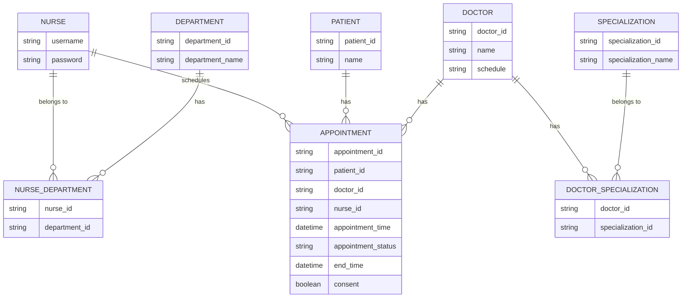

## Software Specification

**The hospital management software allows nurses to manage patients and doctors to handle their patients' appointments.**

### Software Requirements Specifications (SRS):

- SRS 01 : The software shall allow nurses to schedule patient appointments with doctors.
- SRS 02 : The software shall restrict the doctors selectable for an appointment based on the nurse's department and the doctor's specialization.
- SRS 03 : The software shall prevent scheduling of appointments without the patient's consent.
- SRS 04 : The software shall log each patient's appointment and allow viewing access to the doctor and nurse involved.
- SRS 05 : The software shall consider the doctor's schedule and availability when scheduling an appointment.

### User Stories:

- US 01: As a nurse, I want to schedule appointments for patients with doctors who have the appropriate specialization.
- US 02: As a doctor, I want to view my scheduled appointments so that I can manage my time and patients effectively.
- US 03: As a patient, I want to give consent before any appointment is scheduled to ensure my participation is voluntary.
- US 04: As a nurse, I want to view all the appointments I've scheduled to manage my work and follow up with the respective doctors and patients.
- US 05: As a doctor, I want to be scheduled for appointments only within my field of specialization to ensure I can provide appropriate care.
- US 06: As a nurse, I want the system to consider the doctor's availability while scheduling appointments to avoid conflicts in the doctor's schedule.

### Model Relationships Specifications:

Nurses belong to various departments. In our ER diagram, the NURSE and DEPARTMENT entities are connected via the NURSE_DEPARTMENT junction table, signifying a many-to-many relationship. This allows each nurse to be associated with multiple departments and vice versa.

Doctors have various specializations. Similar to nurses, the DOCTOR and SPECIALIZATION entities are linked via the DOCTOR_SPECIALIZATION junction table. This relationship also enables a many-to-many mapping, allowing each doctor to hold multiple specializations and each specialization to be possessed by multiple doctors.

### Questions

1) Based on the Model and SRS specification, there is a mistake in the diagram. Please open [Mermaid Live Editor](https://mermaid.live/). Copy paste the diagram and fix it.
2) Do you have any suggestions to better model the specifications?
